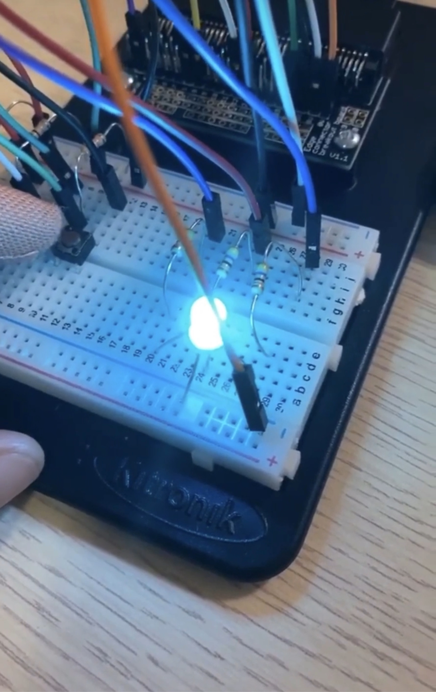

 ### Assessment 1: Replication project ###

*Markdown reference: https://guides.github.com/features/mastering-markdown/*

Replication project choice

# Guitar #

## Related project 1 ##

Flash the hex file onto the BBC micro:bit 
This experiment related to my work because I wanted my guitar to have the light display like a volume that keep on moving. 
https://make.techwillsaveus.com/microbit/activities/air-guitar
https://makecode.microbit.org/v1/87337-04361-88101-06426

This is what i have experiment
https://makecode.microbit.org/#editor

## Running Volume ##
https://makecode.microbit.org/#editor

#### Photo of completed project ####

 ``

(Insert a caption here)

 ## Reflection 2 ##
 
 In this experiment I just invest it from the basic experiment which created my own tone.
 https://makecode.microbit.org/#editor

Also, i try to used aluminium foils instead od cocrodile clip and it work very well. Moreover, while I used cocrodile clip there is a light come up from the BBC microbit but the light aren't comeup while using cocrodile clip. 

## Reflection 3 ##

Ligh sensor and Analog inputs

With this experiment I try to play with the light sensor once agin. At this time I create my name (NOON) to BBC microbit. 
https://makecode.microbit.org/#editor

## NOON ##

#### Photo of completed project ####
In the code below, replace imagemissing.jpg with the name of the image, which should be in the kitexperiments folder.

Reflection 4 
How to create a RGB Led and to observe a different colours

https://makecode.microbit.org/#editor
 

In this experiment, i find out th echanging of the colour and it going to make my guitar be colourful. 

## Driving with colour ##

## Reflection 5 ##

Using a transistor to drive a motor. 
https://makecode.microbit.org/#editor

In this experiment, something new to new was about putting the fan onto my guitar. 
I found that this experiment could create my guitar different from other. 

Guitar with fan.
#### Photo of completed project ####
In the code below, replace imagemissing.jpg with the name of the image, which should be in the kitexperiments folder.

(Insert a caption here)

## Reflection 6 ##

How to Capacitor Charge Circuit 

In this experiment, I try to display a charge percenrtage on the Led diplay. The BBc microbit will be programmed to display the charge level of th ecapacitor both numerically and using external Leds to create a colour coded display. 

Circuit

#### Photo of completed project ####

(this is a image of circuit)

## Reading reflections ##

Reflective reading is an important part of actually making your reading worthwhile. Don't just read the words to understand what they say: read to see how the ideas in the text fit with and potentially change your existing knowledge and maybe even conceptual frameworks. We assume you can basically figure out what the readings mean, but the more important process is to understand how that changes what you think, particularly in the context of your project.

For each of the assigned readings, answer the questions below.

## Reading: Don Norman, The Design of Everyday Things, Chapter 1 (The Psychopathology of Everyday Things)

What I thought before: Describe something that you thought or believed before you read the source that was challenged by the reading.

I though before the reading that the reason people press buttons on crosswalks and elivators was to make the system thing that there is a larger demand for it there for tricking the machiene into going faster. The source challenged my view on this by arguing that the reason it is done is because there is a lack of feedback. The feedback missing is the ability to let you know its working on you request. What I learned: Describe what you now know or believe as a result of the reading. Don't just describe the reading: write about what changed in YOUR knowledge.

I learned that the feedback we recieve from things is very important and tricky to get right. I had the view that a simple form of feedback could do the jb like a buzz for example. What changed my view was when Norman explained how a ill equipped feedback system can be annoying more than it is helpful and can often turn people away from the device. Gettign the timing and tone of the feedback right is crutial and should be a main focus when designing an project.

What I would like to know more about: Describe or write a question about something that you would be interested in knowing more about. I would like to know how me or a company can go about finding the right feedback for diffrent situations,people and cultures. How could this be tested and achieved.

How this relates to the project I am working on: Describe the connection between the ideas in the reading and one of your current projects or how ideas in the reading could be used to improve your project.

This reading relates to my project because it touches on the way users look at something and the best way is to keep them involved in what they are lookig at. For example I can use the infomation i have recieved from this reading to make myproject more user friendly. I can attempt ways of signaling that though making a hand move towards a colour to signify hot or cold, or a fan copuld spin if it became to hot to let the user know to cool down.

## Reading: Chapter 1 of Dan Saffer, Microinteractions: Designing with Details, Chapter 1

What I thought before: Describe something that you thought or believed before you read the source that was challenged by the reading.

Before this reading i had no prior knowlege to the premise of micro interactions. I found that they are extremly common especially in todyas society and that a failure or lack of a microinteraction can lead to disaster

What I learned: Describe what you now know or believe as a result of the reading. Don't just describe the reading: write about what changed in YOUR knowledge. I learned that microinteractions have a huge roll in making a design more functional and easier to use for a user. They often give the product a reason to be bought due to one of its features.

What I would like to know more about: Describe or write a question about something that you would be interested in knowing more about.

I would like to know how the micro interactions cause users to favor the device more that other devices with either less or worse microinteractions. Why does it have such an effect on the way people views these things.

How this relates to the project I am working on: Describe the connection between the ideas in the reading and one of your current projects or how ideas in the reading could be used to improve your project.

This will help my project as i can use what i have learnt about micro interactions to make my design more favourable towards people. I can do this by making a button or a heat sencor available to use.

## Reading: Scott Sullivan, Prototyping Interactive Objects

What I thought before: Describe something that you thought or believed before you read the source that was challenged by the reading.

My thoughts before this reading was there is apoint where you are no longer learning from your failures and there is no point contiuing. This reading challenged this by proving that no matter how many mistakes they could make there is always a learing experience that can be drawed apon for future attempts.

What I learned: Describe what you now know or believe as a result of the reading. Don't just describe the reading: write about what changed in YOUR knowledge.

I learnt that there is always a soulution to the project if you test and fail enough untill you have the right infomation to complete the project. It is very hard to complete something first try so the Beta testing period along with others in essiental to success.

What I would like to know more about: Describe or write a question about something that you would be interested in knowing more about.

I would like to know more about the processes they went through for other projects and the results they recieved from them.

How this relates to the project I am working on: Describe the connection between the ideas in the reading and one of your current projects or how ideas in the reading could be used to improve your project.

This is a great reading for my project. When i run into barriers i can test and teast untill i find the issue then move on. By doing this i will eventually succseed in my project. I also learnt that i can use various way to reach the goal not just one.

## Process documentation ##

My guitar project builds with an egg panel, cardboard, masking tape, crocodile clip, and aluminium foil. I used the egg panel as a body of the guitar and cut it into half and put it together as a long shape guitar. The cardboard, i used ot to build the guitar holder. I cut it into rectangle shape and roll up like a handle. After finish with those process I used a masking tape tu glue it as a one piece of work. the reason I chose to use the egg panel because I want to build a new shape of the guitar and it seems to be an interesting style and easy to build. In the one with a piezo buzzer experiment, I used a crocodile clip to join the BBC microbit and Piezo element buzzer to make the sound. However, I found out that aluminium can be used to make the sound as well so, I avoid using a crocodile clip and use aluminium instead. 

## Reflection ##

From this project, I found out several experiments and techniques to play with the BBC micro:bit. I have learn how to create an image and display it on the BBC micro:bit. Also, learn how to create a tone and the light sensor which are totally useful to create my project. However, I"m slightly found an issue while experiment some process. Especially, with the speaker the sound are to quiet maybe becuase the speaker is too small. Nevetheless, I really love to play and experiment with the tone by using the piezo buzzer. 

